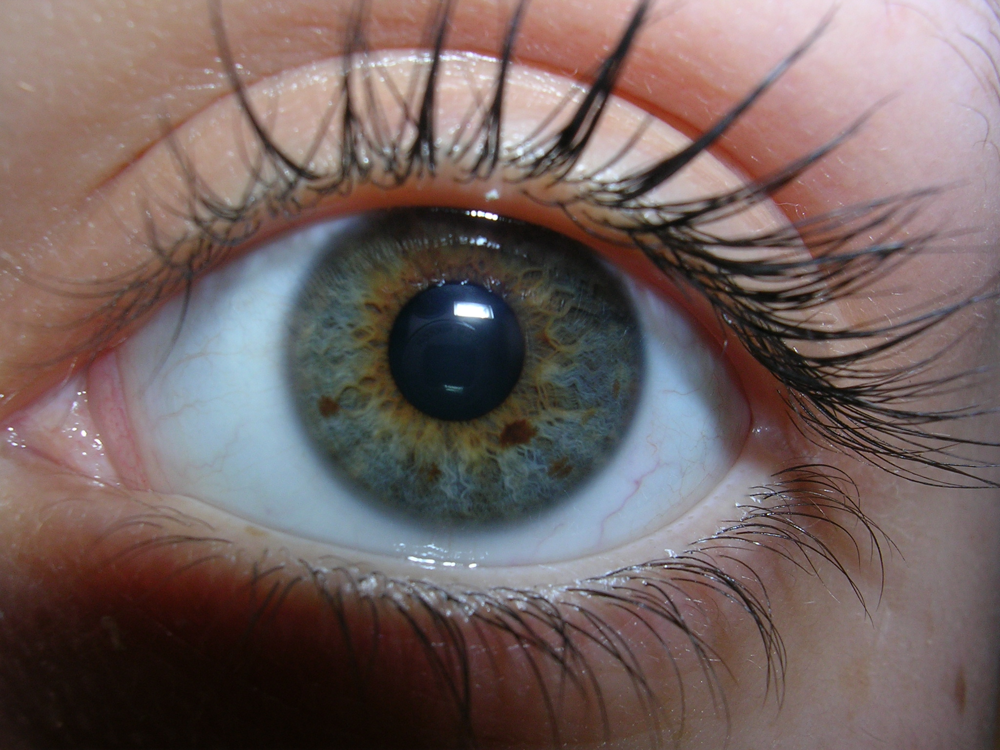
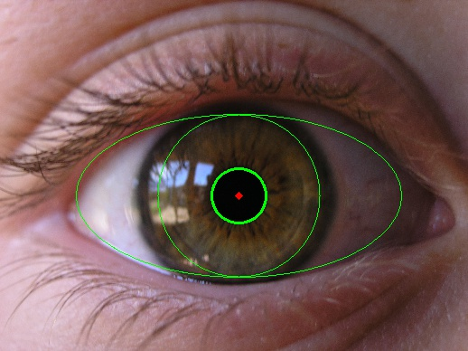
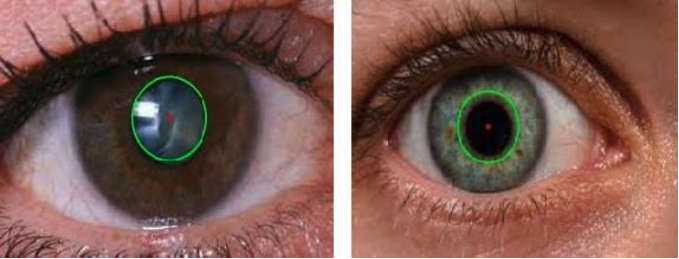
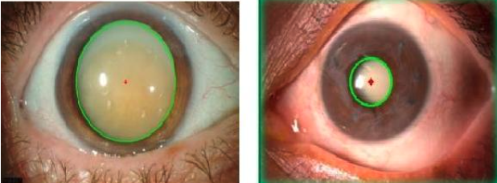

# Cataract-Scanner-Py

A Python-powered tool to accurately identify and annotate the pupil in eye images and detect signs of early cataract.

## Overview

This script utilizes OpenCV's computer vision algorithms to detect and annotate the pupil in ocular images, facilitating the assessment of cataract symptoms.

## Research Publication

For a detailed technical analysis and the methodologies behind this script, refer to our IEEE publication:

[**Automated detection of eye diseases**](https://ieeexplore.ieee.org/document/7566355)


## Sample Images

Below are some sample outputs of our cataract detection:

    

    


<!-- Add more as needed:  -->

## Usage

To use the script, run the following command:

```bash
python detect_cataract.py path_to_image.jpg
```

## Dependencies

The script depends on the following libraries:

- **OpenCV**
- **NumPy**

Ensure you have these libraries installed or check the `requirements.txt` for more information.
